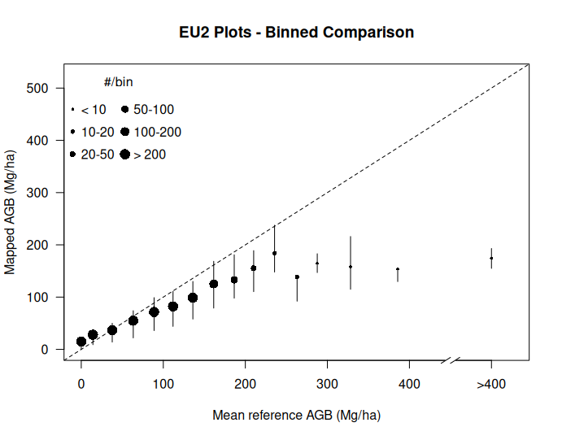
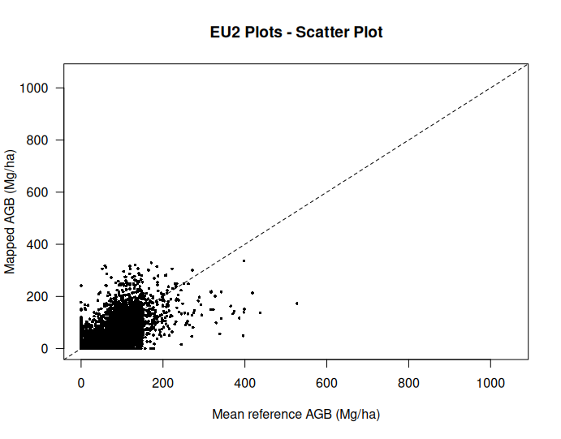

# Plot2Map 

[](https://github.com/aTnT/Plot2Map/actions/workflows/R-CMD-check.yaml)
[](https://github.com/aTnT/Plot2Map/actions/workflows/test-coverage.yaml)
[](https://github.com/aTnT/Plot2Map/actions/workflows/pkgdown.yaml)

Plot2Map is an R package for comparing forest plot data to biomass maps, with a focus on Above Ground Biomass (AGB) estimation and validation.

## Installation

You can install Plot2Map from GitHub:

```R
# install.packages("devtools")
devtools::install_github("aTnT/Plot2Map")
```

## What Plot2Map can be used for

- Pre-processing various types of plot data (point data, polygons, tree-level measurements, lidar)
- Temporal adjustment of plot data to match map epoch
- Estimation of measurement and sampling errors
- Validation of global AGB maps
- Support for custom forest masks
- Aggregation of results at different spatial scales


## Usage

### Plot data pre-processing

Here's a basic workflow using Plot2Map. We'll be using the plots dataset
provided with the package.

```R
library(Plot2Map)

# Load sample plot data. In a real application, this would be your own data
data(plots)

head(plots)
#   PLOT_ID   POINT_X     POINT_Y AGB_T_HA AVG_YEAR SIZE_HA
# 1    AFR7  24.53906   0.9925556   407.60   2011.5       1
# 2    AFR7  24.52981   0.8063056   291.20   2011.5       1
# 3    AFR7  24.52256   0.8274167   366.00   2011.5       1
# 4   AFR10  12.74900   6.2112000    24.90   2007.0       1
# 5    AUS1 145.62743 -37.5924562   699.46   2014.0       1
# 6    AUS1 115.98288 -34.5775977   595.41   2012.0       1
```

We now preprocess the sampled plot data. The first step is to remove plots that
have been deforested based on the Global Forest Change (GFC) dataset (Hansen et al., 2013).
We use `Deforested()` that processes each plot, downloads the necessary GFC forest loss tiles,
and determines if the plot has been deforested beyond a set deforestation threshold or 
if the deforestation occurred before or during the specified map year. In the example
below we use the default 5% deforestation threshold, and we will validate an AGB
map from 2022:

```R
# To reduce data download needs we will only use plots within the "EU2" plot id region
# Keep in mind that this still requires a significant amount of data to be downloaded
preprocessed_plots <- Deforested(plots[plots$PLOT_ID == "EU2", ] , map_year = 2022)

# (...)
# Hansen_GFC-2023-v1.11_lossyear_40N_010W.tif already exists and verified - skipping
# Processing row 5328 with PLOT_ID EU2 and buffered area 0.19 ha ... 
# 
# Hansen_GFC-2023-v1.11_lossyear_40N_010W.tif already exists and verified - skipping
# Deforestation detected in 100% of the buffered area in plot row 5328 with PLOT_ID EU2. 
# The earliest measured year of deforestation is 2016.
# 
# Removed 354 plot(s) that have > 5 % deforested area before/during the 2022 map year.

print(preprocessed_plots)

# $non_deforested_plots
# Simple feature collection with 4974 features and 4 fields
# Geometry type: POINT
# Dimension:     XY
# Bounding box:  xmin: -7.451944 ymin: 36.06354 xmax: 3.24262 ymax: 43.45025
# Geodetic CRS:  WGS 84
# First 10 features:
#    PLOT_ID  AGB_T_HA AVG_YEAR SIZE_HA                    geometry
# 1      EU2  45.90801     2002   0.196  POINT (-6.740698 38.14153)
# 2      EU2  51.24531     2006   0.196   POINT (-5.06974 37.89271)
# 3      EU2  69.61214     2004   0.196   POINT (-2.326055 38.2154)
# 4      EU2  58.50748     2002   0.196  POINT (-4.500239 40.56834)
# 5      EU2 130.73962     2000   0.196  POINT (-4.524572 43.13481)
# 6      EU2  16.50173     2005   0.196 POINT (-0.9116234 42.72071)
# 7      EU2  25.77160     2006   0.196   POINT (-5.17236 38.28734)
# 8      EU2  77.99414     2001   0.196   POINT (2.830552 42.15426)
# 9      EU2  85.97881     2001   0.196  POINT (-4.866867 39.29276)
# 10     EU2  41.99649     2005   0.196  POINT (-2.718447 42.86548)
# 
# $all_plots
# Simple feature collection with 5328 features and 6 fields
# Geometry type: POINT
# Dimension:     XY
# Bounding box:  xmin: -7.451944 ymin: 36.06354 xmax: 3.24262 ymax: 43.46688
# Geodetic CRS:  WGS 84
# First 10 features:
#     PLOT_ID  AGB_T_HA AVG_YEAR SIZE_HA                    geometry defo defo_start_year
# 299     EU2  45.90801     2002   0.196  POINT (-6.740698 38.14153)    0              NA
# 300     EU2  51.24531     2006   0.196   POINT (-5.06974 37.89271)    0              NA
# 301     EU2  69.61214     2004   0.196   POINT (-2.326055 38.2154)    0              NA
# 302     EU2  58.50748     2002   0.196  POINT (-4.500239 40.56834)    0              NA
# 303     EU2 130.73962     2000   0.196  POINT (-4.524572 43.13481)    0              NA
# 304     EU2  16.50173     2005   0.196 POINT (-0.9116234 42.72071)    0              NA
# 305     EU2  25.77160     2006   0.196   POINT (-5.17236 38.28734)    0              NA
# 306     EU2  77.99414     2001   0.196   POINT (2.830552 42.15426)    0              NA
# 307     EU2  85.97881     2001   0.196  POINT (-4.866867 39.29276)    0              NA
# 308     EU2  41.99649     2005   0.196  POINT (-2.718447 42.86548)    0              NA
```

We can see that the function returns a list containing two elements:

* `$non_deforested_plots`: A `sf` object with non-deforested plots.

* `$all_plots`: The original input `sf` object with added deforestated proportion (0-1)
w.r.t. to plot area and deforestation start year.

In the next step we assign ecological zones and continents to plot locations. We use
`BiomePair()` for this. This function overlays plot locations with pre-processed data
to assign corresponding FAO ecological zones (biomes), Global Ecological Zones (GEZ)
and continents (zones) to each plot:

```R
preprocessed_plots_biome <- BiomePair(preprocessed_plots$non_deforested_plots)
head(preprocessed_plots_biome)

#   PLOT_ID  AGB_T_HA AVG_YEAR SIZE_HA  POINT_X  POINT_Y   ZONE               FAO.ecozone         GEZ
# 1     EU2  26.57895     2001   0.196 1.967619 42.37488 Europe Temperate mountain system   Temperate
# 2     EU2 207.19827     2001   0.196 1.943181 42.38366 Europe Temperate mountain system   Temperate
# 3     EU2 106.25631     2001   0.196 2.319521 42.40453 Europe Temperate mountain system   Temperate
# 4     EU2  56.08846     2001   0.196 1.820888 42.42750 Europe Temperate mountain system   Temperate
# 5     EU2 143.96612     2001   0.196 3.036482 42.45157 Europe    Subtropical dry forest Subtropical
# 6     EU2 100.97905     2001   0.196 1.723664 42.42646 Europe Temperate mountain system   Temperate
```

In the step below we use `TempApplyVar()` to adjust plot biomass values to align with
the map year by adding or subtracting annual growth increment to older or newer
plots. The function uses growth data from a model-based estimate of growth-age relationships.
The function also computes the temporal variance (standard deviation) of biomass changes based on growth-rate standard deviations.
In the example below we apply temporal adjustment and calculate variance to all Global Ecological Zones (GEZ)
within the plot data:

```R
preprocessed_plots_biome_temp <- TempApplyVar(preprocessed_plots_biome, 2022)
head(preprocessed_plots_biome_temp)

#   PLOT_ID  AGB_T_HA AVG_YEAR SIZE_HA  POINT_X  POINT_Y   ZONE               FAO.ecozone         GEZ AGB_T_HA_ORIG sdGrowth
# 1     EU2  91.67895     2001   0.196 1.967619 42.37488 Europe Temperate mountain system   Temperate      26.57895     65.1
# 2     EU2 207.19827     2001   0.196 1.943181 42.38366 Europe Temperate mountain system   Temperate     207.19827      0.0
# 3     EU2 106.25631     2001   0.196 2.319521 42.40453 Europe Temperate mountain system   Temperate     106.25631      0.0
# 4     EU2 121.18846     2001   0.196 1.820888 42.42750 Europe Temperate mountain system   Temperate      56.08846     65.1
# 5     EU2 164.96612     2001   0.196 3.036482 42.45157 Europe    Subtropical dry forest Subtropical     143.96612     21.0
# 6     EU2 100.97905     2001   0.196 1.723664 42.42646 Europe Temperate mountain system   Temperate     100.97905      0.0
```
Note how the `$AGB_T_HA`, `$AGB_T_HA_ORIG` and `$sdGrowth` columns are added to the plot dataset. The first corresponding 
to the adjusted biomass values for the specified `map_year`, the second keeping the original biomass values before adjustment and the 
last adding the temporal standard deviation of the biomass adjustment.


### AGB map validation

Now let's suppose we want to validate an AGB map on the `sampled_plots` data above.
We give an example of doing this with the `invDasymetry()` function where the AGB
map is the ESA-CCI AGB dataset.

This function performs inverse dasymetric mapping on plot data. It selects plots
based on given criteria, optionally aggregates them, and calculates tree cover fraction and AGB
for each plot or cell. In our case we use a tree cover threshold of 10% meaning that only areas
with tree cover percentage above this threshold will contribute to biomass estimates.

```R
# Validate AGB map
AGBdata <- invDasymetry(plot_data = preprocessed_plots_biome_temp,
                       dataset = "esacci",
                       is_poly = FALSE,
                       threshold = 10,
                       map_year = 2022,
                       parallel = TRUE)
                       
# memfrac   : 0.5
# tolerance : 0.1
# verbose   : FALSE
# todisk    : FALSE
# tempdir   : /tmp/RtmpjdE3bA
# datatype  : FLT4S
# memmin    : 1
# progress  : 3
# 4975 plots or cells being processed...
# Processing 4975 plots in 100 batches of up to 50 plots each
# Processing complete. Results: 
# 
#     plotAGB_10 tfPlotAGB orgPlotAGB mapAGB SIZE_HA          x        y
# 1    91.678952  91.67895  26.578952     49   0.196  1.9676189 42.37488
# 2   207.198266 207.19827 207.198266     95   0.196  1.9431806 42.38366
# 3   106.256307 106.25631 106.256307    133   0.196  2.3195210 42.40453
# 4   121.188457 121.18846  56.088457      6   0.196  1.8208879 42.42750
# 5   164.966116 164.96612 143.966116    105   0.196  3.0364816 42.45157
# 6    88.356669 100.97905 100.979051    114   0.196  1.7236641 42.42646
# (...)
```

Now that we have the validation data from `invDasymetry()`, we can analyze and visualize the results. The function returns a data frame with several columns, including:

- `plotAGB_[threshold]`: AGB values adjusted for forest cover threshold (e.g., plotAGB_10)
- `tfPlotAGB`: Tree-filtered plot AGB (only when not aggregated)
- `orgPlotAGB`: Original plot AGB values
- `mapAGB`: The AGB values extracted from the map
- `SIZE_HA`: Plot size in hectares
- `x` and `y`: Plot coordinates

We can now visualize the relationship between the reference plot data and map values using the plotting functions:

```R
# Visualize results with binned plot
Binned(AGBdata$plotAGB_10, AGBdata$mapAGB, 
       "EU2 Plots - Binned Comparison")
```


```R
# Create a scatter plot
Scatter(AGBdata$plotAGB_10, AGBdata$mapAGB, 
        "EU2 Plots - Scatter Plot")
```


```R
# Calculate accuracy metrics
# Use fewer intervals since we have a small sample
Accuracy(AGBdata, intervals = 6)

#   AGB bin (Mg/ha)    n AGBref (Mg/ha) AGBmap (Mg/ha) RMSD varPlot
# 1           0-100 3104             40             40   40       1
# 2         100-150 1556            121             89   63       1
# 3         150-200  157            170            128   76       1
# 4         200-250   53            219            166   84       1
# 5         250-300   19            270            146  139       1
# 6            >300   20            371            159  227       1
# 7           total 4909             74             60   53       1
```

The output of the `Accuracy()` function provides an assessment of map accuracy including
binned statistics by AGB ranges.

### Handling Uncertainty

Plot2Map also provides a tool for calculating and incorporating plot uncertainty in plot data.
The `calculateTotalUncertainty()` function combines measurement, sampling, and growth uncertainties:

```R
# Calculate total plot uncertainty
preprocessed_plots_biome_temp_uncertainty <- calculateTotalUncertainty(preprocessed_plots_biome_temp, 
                                               map_year = 2022,
                                               map_resolution = 100)
                                               
# Calculating tree measurement uncertainty using RF model
# Calculating sampling uncertainty using Rejou-Mechain approach
# Loading sampling error data from package file
# Using existing growth uncertainty (sdGrowth) values
# Total uncertainty calculated for plot data of type: point

# Print the uncertainty components
print(preprocessed_plots_biome_temp_uncertainty$uncertainty_components)

# measurement    sampling      growth 
#   0.2337400   0.1331422   0.6331177 

# Inspect plot data with uncertainty
head(preprocessed_plots_biome_temp_uncertainty$data)
#   PLOT_ID  AGB_T_HA AVG_YEAR SIZE_HA  POINT_X  POINT_Y   ZONE               FAO.ecozone         GEZ AGB_T_HA_ORIG sdGrowth   sdTree RS_HA ratio     sdSE   varPlot  sdTotal
# 1     EU2  91.67895     2001   0.196 1.967619 42.37488 Europe Temperate mountain system   Temperate      26.57895     65.1 21.28590     1 0.196 22.01657 5175.8289 71.94323
# 2     EU2 207.19827     2001   0.196 1.943181 42.38366 Europe Temperate mountain system   Temperate     207.19827      0.0 29.50758     1 0.196 22.01657 1355.4264 36.81612
# 3     EU2 106.25631     2001   0.196 2.319521 42.40453 Europe Temperate mountain system   Temperate     106.25631      0.0 21.56276     1 0.196 22.01657  949.6819 30.81691
# 4     EU2 121.18846     2001   0.196 1.820888 42.42750 Europe Temperate mountain system   Temperate      56.08846     65.1 24.19848     1 0.196 22.01657 5308.3057 72.85812
# 5     EU2 164.96612     2001   0.196 3.036482 42.45157 Europe    Subtropical dry forest Subtropical     143.96612     21.0 35.91662     1 0.196 22.01657 2215.7332 47.07157
# 6     EU2 100.97905     2001   0.196 1.723664 42.42646 Europe Temperate mountain system   Temperate     100.97905      0.0 21.25330     1 0.196 22.01657  936.4321 30.60118
```

   
### Aggregated Analysis

Plot2Map allows for spatial aggregation of plots into larger cells for analysis at different scales:

```R
# Aggregated analysis at 0.1 degree resolution with minimum 3 plots per cell
AGBdata_agg <- invDasymetry(plot_data = preprocessed_plots_biome_temp_uncertainty$data,
                           clmn = "ZONE", 
                           value = "Europe",
                           aggr = 0.1,         # 0.1 degree aggregation
                           minPlots = 3,       # Minimum 3 plots per cell
                           dataset = "esacci",
                           is_poly = FALSE)

# Visualize aggregated results
Binned(AGBdata_agg$plotAGB_10, AGBdata_agg$mapAGB, 
      "Europe - Aggregated 0.1 arc-deg")
```


### Working with Different Plot Types

Plot2Map can handle various types of plot data:

1. **Point data with AGB estimates**:
   - Pre-formatted (see documentation)
   - Unformatted (can be processed with `RawPlots()`)

2. **Polygon data with corner coordinates**:
   - Can be processed with `Polygonize()`

3. **Tree-level measurement data**:
   - Processed with `MeasurementErr()` which estimates AGB and uncertainty

4. **Nested plot data (with sub-plots)**:
   - Processed with `Nested()` followed by `MeasurementErr()`

5. **Lidar-based reference maps**:
   - Processed with `RefLidar()`

See the "Plot data preparation" vignette for more information.


## References

Araza et al., A comprehensive framework for assessing the accuracy and uncertainty of global above-ground biomass maps,
Remote Sensing of Environment, Volume 272, 2022, 112917, ISSN 0034-4257, https://doi.org/10.1016/j.rse.2022.112917.


