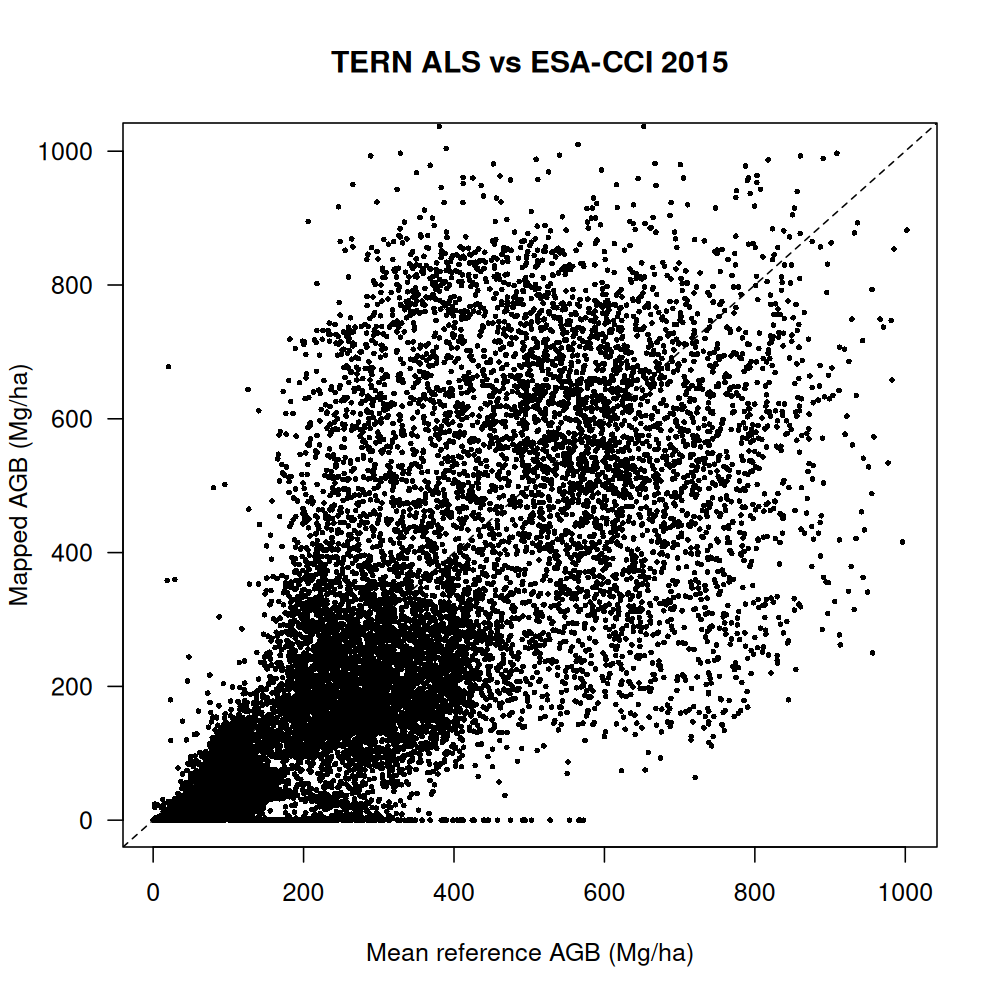
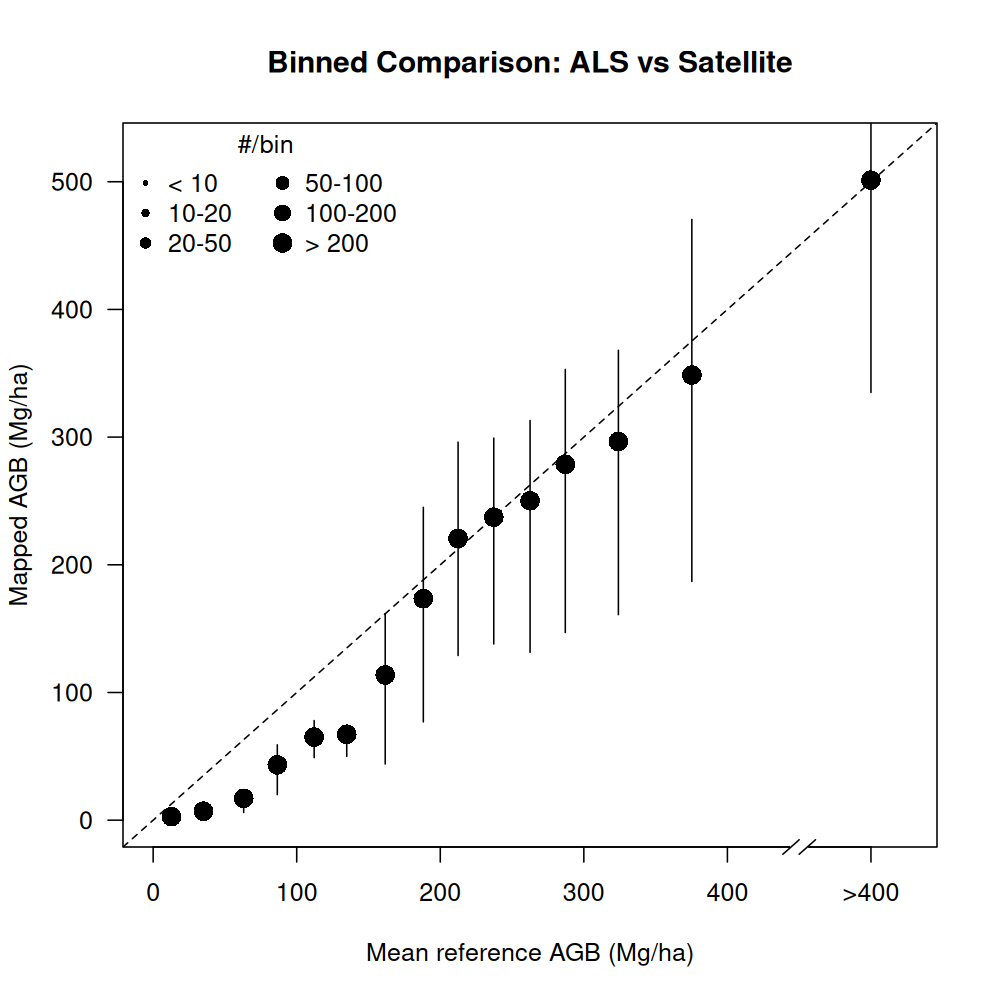
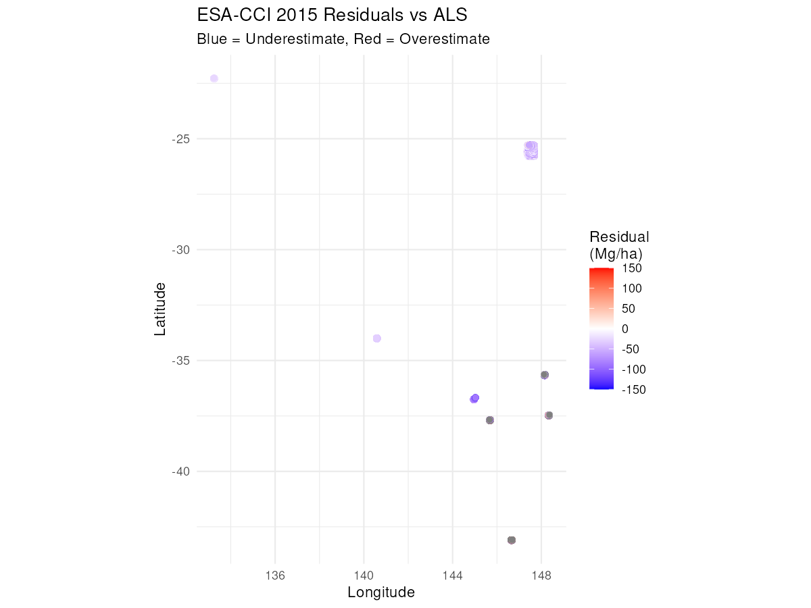

# Validating AGB Maps with Airborne LiDAR Data

## Introduction

Airborne Laser Scanning (ALS), provides high-resolution
three-dimensional measurements of forest structure that can be used to
estimate Above-Ground Biomass (AGB) with remarkable accuracy. Unlike
field plots that provide point measurements, ALS offers wall-to-wall
coverage at fine spatial resolutions (often 20-100m), making it an
excellent reference dataset for validating satellite-derived biomass
maps.

This vignette demonstrates how to use the Plot2Map package to validate
satellite biomass products against ALS-derived AGB estimates. We’ll use
a sample dataset from the TERN (Terrestrial Ecosystem Research Network)
Australia, which provides ALS-derived biomass maps at 100m resolution
for multiple sites across Australia. The workflow includes:

- Loading ALS data using the
  [`RefLidar()`](https://atnt.github.io/Plot2Map/reference/RefLidar.md)
  function
- Preparing uncertainty estimates from Coefficient of Variation (CV)
  maps
- Validating against ESA-CCI Biomass 2015 product
- Calculating accuracy metrics and creating visualizations
- Interpreting results in the context of Australian forest monitoring

ALS validation is particularly valuable when you need to assess spatial
patterns of map accuracy, validate products at fine resolutions, or work
in regions with limited field plot data. However, field plots remain
essential for calibrating ALS models and quantifying uncertainties
across diverse forest types.

## Setup and Load Required Packages

``` r
library(Plot2Map)
library(terra)
library(ggplot2)
```

## Load TERN ALS Data

The TERN dataset includes ALS-derived biomass estimates and their
associated uncertainties for multiple sites across Australia. The data
were collected between 2011-2015 and processed to 100m grid cells (1
hectare each).

``` r
# Get paths to bundled TERN data
tern.agb.dir <- sample_lidar_folder("TERN_data_package_v01/TERN_AGBmaps")
tern.cv.dir <- sample_lidar_folder("TERN_data_package_v01/TERN_CVmaps")

# Preview available files
list.files(tern.agb.dir)
list.files(tern.cv.dir)
# [1] "ALC_2014_AGB_100m.tif" "CLP_2012_AGB_100m.tif" ...
# [1] "ALC_2014_CV_100m.tif" "CLP_2012_CV_100m.tif" ...
```

The
[`RefLidar()`](https://atnt.github.io/Plot2Map/reference/RefLidar.md)
function automatically processes ALS rasters by:

- Detecting and reprojecting coordinate systems to WGS84
- Extracting plot IDs and years from filenames
- Converting raster pixels to a point data frame
- Preparing data for Plot2Map validation workflows

``` r
# Load Above-Ground Biomass raster
agb_data <- RefLidar(
  lidar.dir = tern.agb.dir,
  raster_type = "AGB",
  allow_interactive = FALSE  # Non-interactive mode for reproducibility
)

# Preview data structure
head(agb_data)
cat("Total ALS cells:", nrow(agb_data), "\n")
cat("AGB range:", range(agb_data$AGB, na.rm = TRUE), "Mg/ha\n")
cat("Mean AGB:", round(mean(agb_data$AGB, na.rm = TRUE), 1), "Mg/ha\n")
# Found 13 raster files for processing
# Validating coordinate reference systems...
# Files requiring CRS transformation to EPSG:4326 :
# ALC_2014_AGB_100m.tif, CLP_2012_AGB_100m.tif, GWW_2012_AGB_100m.tif, ...
# Using raster type: AGB
# Processing raster files with multi-band support...
# Transforming rasters to target CRS: EPSG:4326
# Reprojecting raster with CRS: WGS 84 / UTM zone 53S
# Reprojecting raster with CRS: WGS 84 / UTM zone 54S
# Reprojecting raster with CRS: WGS 84 / UTM zone 51S
# Reprojecting raster with CRS: WGS 84 / UTM zone 55S
# Reprojecting raster with CRS: WGS 84 / UTM zone 56S
# Reprojecting raster with CRS: WGS 84 / UTM zone 52S
# Calculated average cell size: 1.000914 hectares
# Attempting automatic pattern detection...
# Analyzing filename patterns from: ALC_2014_AGB_100m
# Detected Pattern 4: Australia format
# Using automatically detected patterns (confidence: high)
# Successfully extracted PLOT_ID and YEAR using automatic detection
# Sample PLOT_ID values: ALC, CLP, GWW
# Sample YEAR values: 2014, 2012, 2015

# === RefLidar Processing Summary ===
# Extracted points: 37440
# Unique plots: 13
# Year range: 2011 - 2015
# Cell size (ha): 1.000914
# CRS transformations: Yes
# Multi-band processing: No
#   PLOT_ID  POINT_X   POINT_Y      AGB AVG_YEAR
# 2     ALC 133.2278 -22.26248 39.68643     2014
# 3     ALC 133.2287 -22.26248 36.53252     2014
# 4     ALC 133.2297 -22.26248 39.39373     2014
# 5     ALC 133.2306 -22.26248 36.42969     2014
# 6     ALC 133.2315 -22.26248 31.54718     2014
# 7     ALC 133.2325 -22.26248 29.89234     2014
# Total ALS cells: 37440
# AGB range: 0 1002.078 Mg/ha
# Mean AGB: 182.7 Mg/ha
```

The Coefficient of Variation (CV) provides a measure of uncertainty in
the ALS-derived biomass estimates. This will be used to weight
observations and calculate total uncertainty.

``` r
# Load Coefficient of Variation (uncertainty)
cv_data <- RefLidar(
  lidar.dir = tern.cv.dir,
  raster_type = "CV",
  allow_interactive = FALSE
)

# Preview CV values
cat("CV range:", round(range(cv_data$CV, na.rm = TRUE), 3), "\n")
cat("Mean CV:", round(mean(cv_data$CV, na.rm = TRUE), 3), "\n")
# Found 13 raster files for processing
# Validating coordinate reference systems...
# Files requiring CRS transformation to EPSG:4326 :
# ALC_2014_CV_100m.tif, CLP_2012_CV_100m.tif, GWW_2012_CV_100m.tif, ...
# Using raster type: CV
# Processing raster files with multi-band support...
# Transforming rasters to target CRS: EPSG:4326
# Calculated average cell size: 1.000914 hectares
# Attempting automatic pattern detection...
# Analyzing filename patterns from: ALC_2014_CV_100m
# No recognized pattern found, using fallback configuration
# Non-interactive mode: Using filename as PLOT_ID
# Extracted years from filenames

# === RefLidar Processing Summary ===
# Extracted points: 37420
# Unique plots: 13
# Year range: 2011 - 2015
# Cell size (ha): 1.000914
# CRS transformations: Yes
# Multi-band processing: No
# CV range: 0.145 1
# Mean CV: 0.449
```

## Data Preparation

Now we’ll prepare the ALS data for validation by calculating
uncertainties and adding required metadata fields.

``` r
# Calculate SD from CV × AGB
agb_data$sdTree <- cv_data$CV * agb_data$AGB

# Rename AGB column for Plot2Map compatibility
names(agb_data)[names(agb_data) == "AGB"] <- "AGB_T_HA"

# Preview uncertainty
summary(agb_data[, c("AGB_T_HA", "sdTree")])
#     AGB_T_HA           sdTree
# Min.   :   0.00   Min.   :  0.00
# 1st Qu.:  43.22   1st Qu.: 25.91
# Median :  92.74   Median : 37.04
# Mean   : 182.66   Mean   : 48.64
# 3rd Qu.: 285.80   3rd Qu.: 65.76
# Max.   :1002.08   Max.   :358.39  
```

The
[`BiomePair()`](https://atnt.github.io/Plot2Map/reference/BiomePair.md)
function assigns ecological zones based on coordinates, which is
necessary for selecting appropriate biomass models and validation
datasets.

``` r
# Assign ecological zones using BiomePair()
agb_data <- BiomePair(agb_data)

# Apply temporal adjustment to align ALS years (2011-2015) with map year (2015)
# This adjusts AGB values based on growth rates and creates uncertainty from temporal mismatch
agb_data <- TempApplyVar(agb_data, map_year = 2015)

# Add plot size (100m × 100m = 1 hectare)
agb_data$SIZE_HA <- 1

# Check assigned zones and years
unique(agb_data$ZONE)
unique(agb_data$FAO.ecozone)
unique(agb_data$AVG_YEAR)
# [1] "Australia"
# [1] "Temperate oceanic forest" "Temperate mountain system"
# [4] "Subtropical steppe" "Subtropical humid forest"
# [7] "Subtropical desert" "Tropical rainforest"
# [10] "Tropical dry forest"
# [1] 2014 2012 2015 2011 2013
```

The
[`calculateTotalUncertainty()`](https://atnt.github.io/Plot2Map/reference/calculateTotalUncertainty.md)
function combines multiple sources of uncertainty:

- `sdTree`: Measurement uncertainty from ALS processing (from CV values)
- `sdGrowth`: Uncertainty from temporal adjustment (calculated by
  [`TempApplyVar()`](https://atnt.github.io/Plot2Map/reference/TempApplyVar.md))
- `sdSE`: Standard error from sampling (spatial variability)
- `varPlot`: Total variance used for weighted aggregation

For ALS data at 1 hectare resolution, measurement error typically
dominates over sampling and growth uncertainty.

``` r
# Calculate comprehensive uncertainty (measurement + scale mismatch)
agb_unc <- calculateTotalUncertainty(
  plot_data = agb_data,
  map_year = 2015,  # Match the temporal adjustment year
  map_resolution = 100  # ESA-CCI resolution in meters
)

# Extract processed data with uncertainty
als_plots <- agb_unc$data

# View uncertainty components
print(agb_unc$uncertainty_components)
# measurement    sampling      growth
#  0.812       0.169       0.019

# Summary of total uncertainty
cat("Mean total uncertainty (SD):",
    round(mean(als_plots$sdTotal, na.rm = TRUE), 1), "Mg/ha\n")
# Mean total uncertainty (SD): 52.1 Mg/ha
cat("Uncertainty range:",
    round(range(als_plots$sdTotal, na.rm = TRUE), 1), "Mg/ha\n")
# Uncertainty range: 15.1 358.7 Mg/ha
```

## Validation Against ESA-CCI 2015

Now we’ll extract ESA-CCI biomass values at each ALS cell location. The
[`invDasymetry()`](https://atnt.github.io/Plot2Map/reference/invDasymetry.md)
function handles:

- Downloading ESA-CCI tiles (cached after first download)
- Applying tree cover thresholds
- Extracting map values at reference locations
- Calculating validation metrics

Note: The first run will download ~600MB of ESA-CCI tiles. Subsequent
runs use cached data.

``` r
# Extract ESA-CCI 2015 biomass values at ALS locations
validation <- invDasymetry(
  plot_data = als_plots,
  clmn = "ZONE",
  value = "Australia",
  aggr = NULL,              # No aggregation - cell-level validation
  threshold = 10,           # 10% tree cover threshold
  dataset = "esacci",
  esacci_biomass_year = 2015,
  map_resolution = 0.001,   # ~100m in degrees
  parallel = FALSE
)

# View validation results
cat("Validation cells after filtering:", nrow(validation), "\n")
# Validation cells after filtering: 2385
head(validation[, c("plotAGB_10", "mapAGB", "varPlot", "x", "y")])
#   plotAGB_10 mapAGB  varPlot        x         y
# 1   42.93502     14 905.3276 133.2737 -22.30556
# 2   42.88473     13 904.2596 133.2737 -22.30463
# 3   33.10369     12 754.1814 133.2737 -22.30182
# 4   32.53916     15 750.0342 133.2737 -22.29994
# 5   32.18783     15 744.5615 133.2737 -22.29714
# 6   30.34475     15 722.6837 133.2737 -22.29620
```

The validation data frame contains:

- `plotAGB_10`: ALS biomass after 10% tree cover filter
- `mapAGB`: ESA-CCI 2015 biomass at same locations
- `varPlot`: Uncertainty for weighted aggregation
- `x`, `y`: Coordinates

The tree cover threshold filters out non-forested areas where biomass
estimates are less reliable.

## Accuracy Assessment

The
[`Accuracy()`](https://atnt.github.io/Plot2Map/reference/Accuracy.md)
function calculates validation metrics stratified by AGB bins, which
helps identify systematic patterns like saturation at high biomass
values. The function now automatically uses the `varPlot` column from
your input data (calculated by
[`calculateTotalUncertainty()`](https://atnt.github.io/Plot2Map/reference/calculateTotalUncertainty.md)
and preserved by
[`invDasymetry()`](https://atnt.github.io/Plot2Map/reference/invDasymetry.md))
for uncertainty-aware validation. The varPlot values shown in the output
represent the mean variance within each AGB bin.

``` r
# Calculate accuracy metrics by AGB bins
accuracy_results <- Accuracy(
  df = validation,
  intervals = 8,
  dir = "results",
  str = "tern_vs_esacci2015"
)

# Display results
print(accuracy_results)
#   AGB bin (Mg/ha)    n AGBref (Mg/ha) AGBmap (Mg/ha) RMSD varPlot
# 1            0-50 2385             33             13   20     753
# 9           total 2385             33             13   20     753
```

The `varPlot` column now shows the actual mean variance values for each
AGB bin, reflecting the uncertainty in your ALS measurements. Higher
varPlot values indicate greater uncertainty in those biomass ranges.

Let’s extract and interpret the overall metrics:

``` r
# Extract overall metrics from accuracy table
overall <- accuracy_results[nrow(accuracy_results), ]

# Calculate additional metrics from validation data
r_value <- cor(validation$plotAGB_10, validation$mapAGB, use = "complete.obs")
r2_value <- r_value^2
bias_value <- mean(validation$mapAGB - validation$plotAGB_10, na.rm = TRUE)

cat("Correlation (R):", round(r_value, 3), "\n")
# Correlation (R): 0.286
cat("R²:", round(r2_value, 3), "\n")
# R²: 0.082
cat("RMSE:", round(overall$RMSD, 1), "Mg/ha\n")
# RMSE: 20.3 Mg/ha
cat("Bias:", round(bias_value, 1), "Mg/ha\n")
# Bias: -19.7 Mg/ha
cat("Mean ALS AGB:", round(overall$`AGBref (Mg/ha)`, 1), "Mg/ha\n")
# Mean ALS AGB: 32.5 Mg/ha
cat("Mean ESA-CCI AGB:", round(overall$`AGBmap (Mg/ha)`, 1), "Mg/ha\n")
# Mean ESA-CCI AGB: 12.8 Mg/ha
cat("Sample size:", overall$n, "cells\n")
# Sample size: 2385 cells
```

**Interpreting the metrics:**

The validation results provide insight into agreement between ALS and
ESA-CCI 2015. Specific metrics will vary by site, forest type, and
biomass range.

The
[`Accuracy()`](https://atnt.github.io/Plot2Map/reference/Accuracy.md)
function stratifies results by AGB bins, helping identify systematic
patterns like saturation at high biomass values.

## Visualisations

Visual comparisons help identify systematic patterns and spatial
structure in validation errors.

### Scatter Plot

The scatter plot shows individual cell comparisons. Points near the 1:1
line (dashed) indicate good agreement.

``` r
# Create scatter plot comparing ALS vs ESA-CCI
Scatter(
  x = validation$plotAGB_10,
  y = validation$mapAGB,
  caption = "TERN ALS vs ESA-CCI 2015",
  fname = "tern_als_scatter.png",
  outDir = "results"
)
```



TERN ALS vs ESA-CCI 2015 Scatter Plot

### Binned Comparison

The binned plot aggregates observations into AGB bins, showing trends
more clearly than individual points.

``` r
# Create binned comparison plot
Binned(
  x = validation$plotAGB_10,
  y = validation$mapAGB,
  caption = "Binned Comparison: ALS vs Satellite",
  fname = "tern_als_binned.png",
  outDir = "results"
)
```



Binned Comparison: ALS vs ESA-CCI 2015

### Spatial Residuals Map

Spatial visualization of residuals (map - ALS) can reveal geographic
patterns in errors, such as topographic effects or edge artifacts.

``` r
# Calculate residuals (map - ALS)
validation$residual <- validation$mapAGB - validation$plotAGB_10

# Create spatial visualization
library(ggplot2)
ggplot(validation, aes(x = x, y = y, color = residual)) +
  geom_point(size = 2.5) +
  scale_color_gradient2(
    low = "blue", mid = "white", high = "red",
    midpoint = 0,
    name = "Residual\n(Mg/ha)",
    limits = c(-150, 150)
  ) +
  coord_fixed() +
  theme_minimal() +
  labs(
    title = "ESA-CCI 2015 Residuals vs ALS",
    subtitle = "Blue = Underestimate, Red = Overestimate",
    x = "Longitude", y = "Latitude"
  )
```



ESA-CCI 2015 Residuals vs ALS

## Discussion and Interpretation

**TERN dataset characteristics:**

The TERN ALS dataset covers 37,440 cells across 13 sites in Australia,
spanning from 2011 to 2015. The biomass range (0-1,002 Mg/ha, mean 182.7
Mg/ha) reflects the diversity of Australian ecosystems, from open
woodlands to dense forests.

**Uncertainty composition:**

The validation uses multiple uncertainty sources:

- **Measurement uncertainty** (81.2%) from ALS CV values, dominant in
  most cells
- **Sampling uncertainty** (16.9%) accounts for spatial variability
  between cells
- **Growth uncertainty** (1.9%) from
  [`TempApplyVar()`](https://atnt.github.io/Plot2Map/reference/TempApplyVar.md)
  accounts for temporal mismatch between ALS acquisition years
  (2011-2015) and map year (2015)
- Mean total uncertainty (SD) of 52.1 Mg/ha (range: 15.1-358.7 Mg/ha)
  indicates higher uncertainty in denser forests

**Expected validation patterns:**

TERN sites span subtropical deserts, subtropical forests, and temperate
ecosystems. ESA-CCI performance will likely vary across these biomes:

- Subtropical forests (e.g., ALC, CLP): Moderate biomass,
  well-documented ALS
- Temperate forests (e.g., ZGZ): Higher biomass, potentially better
  radar response
- Open woodlands: Lower biomass, higher relative uncertainty

The validation output provides site-specific metrics that reveal spatial
patterns in agreement between ALS and satellite-derived biomass.

## Extensions and Next Steps

### Bias Modeling

The validation results can be used to develop bias correction models
that improve satellite map accuracy. The Plot2Map package includes
comprehensive bias modeling functionality demonstrated in the bias
modeling vignette:

``` r
vignette("bias-modeling", package = "Plot2Map")
```

ALS-derived corrections can improve satellite products by:

- Reducing systematic bias across AGB ranges
- Accounting for regional forest structure differences
- Providing spatially continuous training data

### Custom ALS Datasets

This workflow can be applied to your own ALS data. The key requirements
are:

- Georeferenced raster format (GeoTIFF, etc.)
- AGB estimates in Mg/ha
- Optional uncertainty maps (CV, SD, or variance)

``` r
# Example for users with custom ALS data
custom_als <- RefLidar(
  lidar.dir = "path/to/custom/als/",
  raster_type = "AGB",
  allow_interactive = FALSE,
  metadata_map = data.frame(
    filename = c("site1_agb.tif", "site2_agb.tif"),
    plot_id = c("Site1", "Site2"),
    year = c(2020, 2021)
  )
)
```

The `metadata_map` argument allows explicit specification of plot IDs
and years when filenames don’t follow standard naming conventions.

### Related Vignettes

For more information on Plot2Map workflows:

- **Plot data preparation**:
  [`vignette("plot-data-preparation")`](https://atnt.github.io/Plot2Map/articles/plot-data-preparation.md) -
  Field plot data formatting and RefLidar() usage
- **Advanced uncertainty**:
  [`vignette("advanced-uncertainty")`](https://atnt.github.io/Plot2Map/articles/advanced-uncertainty.md) -
  Spatial uncertainty quantification methods
- **Bias modeling**:
  [`vignette("bias-modeling")`](https://atnt.github.io/Plot2Map/articles/bias-modeling.md) -
  Full bias correction workflow from validation to map improvement

## Conclusion

This vignette demonstrated a complete workflow for validating satellite
biomass maps using high-resolution ALS reference data. Starting from the
bundled TERN dataset (37,440 cells across 13 Australian sites), we:

1.  Loaded ALS-derived AGB and uncertainty maps using
    [`RefLidar()`](https://atnt.github.io/Plot2Map/reference/RefLidar.md)
    covering subtropical and temperate forests (2011-2015)
2.  Prepared metadata using
    [`BiomePair()`](https://atnt.github.io/Plot2Map/reference/BiomePair.md)
    and applied temporal adjustment with
    [`TempApplyVar()`](https://atnt.github.io/Plot2Map/reference/TempApplyVar.md)
    to align with map year (2015)
3.  Calculated total uncertainties (measurement 81.2%, sampling 16.9%,
    growth 1.9%)
4.  Validated ESA-CCI 2015 against ALS cells via
    [`invDasymetry()`](https://atnt.github.io/Plot2Map/reference/invDasymetry.md)
5.  Calculated accuracy metrics stratified by AGB bins using
    [`Accuracy()`](https://atnt.github.io/Plot2Map/reference/Accuracy.md)
6.  Created visualizations to identify patterns and spatial structure

**Key characteristics of the TERN validation:**

- **Large sample**: 37,440 cells provide robust spatial coverage of
  Australian forests, enabling detection of regional patterns in
  satellite accuracy
- **Diverse biomes**: Sites span subtropical desert, subtropical forest,
  and temperate ecosystems, testing ESA-CCI performance across forest
  types
- **Moderate biomass range**: Mean AGB of 182.7 Mg/ha (0-1,002 Mg/ha)
  covers typical Australian forest conditions
- **Quantified uncertainty**: CV-derived uncertainties (mean 0.449)
  enable weighted validation that accounts for measurement precision

The validation approach using TERN data provides spatially explicit
information that can guide bias correction, identify regions requiring
improved algorithms, and support development of regionally calibrated
biomass products.

This workflow is readily adaptable to any ALS dataset with appropriate
formatting, making it a valuable tool for researchers validating biomass
products across diverse forest ecosystems. The combination of fine-scale
spatial coverage (100m cells) and quantified uncertainties makes ALS an
excellent complement to traditional field plot validation.
