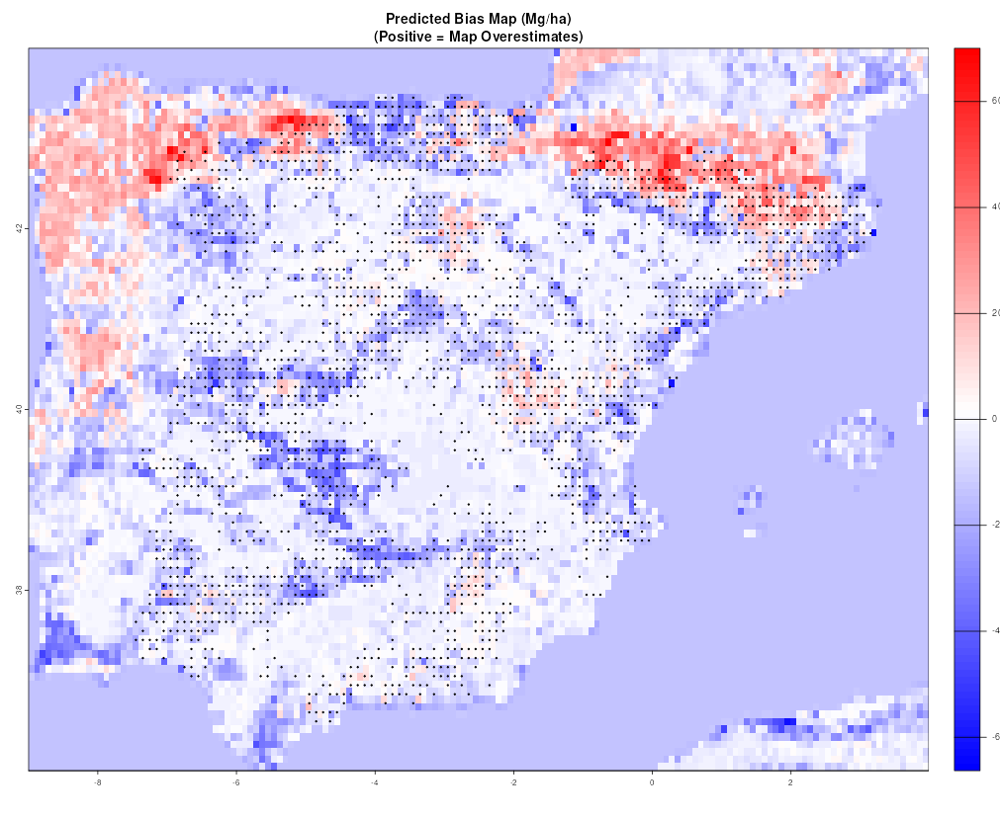

# Bias Modeling and Correction for AGB Maps

## Introduction

Above-ground biomass (AGB) maps derived from satellite remote sensing
are essential for monitoring forest carbon stocks and emissions.
However, these maps often contain systematic biases that vary spatially
and can be predicted using environmental covariates. This vignette
demonstrates how to use Plot2Map’s bias modeling functions to:

1.  Quantify bias patterns in AGB maps using field plot data
2.  Train Random Forest models to predict bias from environmental
    covariates
3.  Generate wall-to-wall bias correction maps
4.  Adjust AGB maps to reduce systematic errors

The bias modeling workflow is particularly valuable for:

- Improving regional carbon stock estimates
- Understanding environmental drivers of map errors
- Creating more accurate AGB products for policy and science
- Quantifying uncertainty in bias-corrected maps

## Theoretical Background

### Understanding Map Bias

**Bias** is the systematic difference between map predictions and true
values. Unlike random errors, bias is predictable and can be modeled.
For AGB maps, bias often correlates with:

- **Forest structure**: Dense forests may be over/underestimated
- **Topography**: Slopes affect radar backscatter and optical
  reflectance
- **Climate**: Precipitation and temperature influence vegetation
  properties
- **Land cover**: Different forest types have different error
  characteristics

### The Bias Modeling Approach

Plot2Map uses a four-step workflow:

1.  **Extract bias**: Calculate plot-level bias (plot AGB - map AGB) and
    associated covariates
2.  **Train model**: Fit Random Forest to predict bias from
    environmental variables
3.  **Predict bias map**: Apply model wall-to-wall to generate bias
    correction surface
4.  **Adjust map**: Subtract predicted bias from original map

## Required Data

Before starting, you need:

1.  **AGB map** (SpatRaster): Remote sensing-derived biomass map (Mg/ha)
2.  **Plot data** (data.frame): Field measurements with coordinates and
    AGB values
3.  **Covariate rasters** (SpatRaster stack): Environmental predictors
4.  **Forest mask** (optional): Binary forest/non-forest map

### Example Data Structure

``` r
# Plot data should have:
head(plot_data)
#>   lon     lat  AGB_T_HA  varPlot  SIZE_HA
#>   -95.5   19.2  125.3    450      1.0
#>   -94.8   18.9  87.6     320      0.5

# AGB map (example)
library(terra)
agb_map <- rast("path/to/agb_map.tif")

# Covariate stack (example: elevation, precipitation, temperature)
covariates <- rast(c("elevation.tif", "precip.tif", "temp.tif"))
names(covariates) <- c("elevation", "precipitation", "temperature")

# Forest mask
forest_mask <- rast("forest_mask.tif")
```

## Step 1.1 Define Study Region and Load Libraries

First, define the study region and load required packages:

``` r
library(Plot2Map)
library(terra)

# Define study region (Iberian Peninsula)
# This region has excellent plot coverage (~5,300 plots) in the Plot2Map::plots dataset
# with good spatial distribution across ~900 x 800 km
study_bbox <- c(xmin = -9, ymin = 36, xmax = 4, ymax = 44)
```

## Step 1.2 Obtain Covariates

You can automate covariate fetching using the
[`spatialcovariates`](https://atnt.github.io/spatialcovariates/)
package:

``` r
# Install spatialcovariates (if not already installed)
# devtools::install_github("aTnT/spatialcovariates")

library(spatialcovariates)

# Step 1: Fetch AGB and SD from ESA CCI
biomass_data <- getESACCIAGB(
  extent = study_bbox,
  year = 2010,
  resolution = "10km"
)
agb_map <- biomass_data$agb  # ESA CCI AGB
sd_map <- biomass_data$sd    # ESA CCI SD

# Step 2: Fetch environmental covariates (as a SpatRaster stack)
covariates_stack <- getBiasCovariates(
  extent = study_bbox,
  year = 2010,
  resolution = "10km",
  n_cores = 4  # Parallel downloads
)

# The stack contains all covariates:
# tcc2010, treecover2000, elevation, slope, aspect, tri, tpi, roughness, biome, ifl
# We'll extract these in Step 2
```

**Alternative: Manual approach using SDtileNames()**:

``` r
# library(Plot2Map)
# library(terra)

# # Obtain SD raster from AGB product using SDtileNames()
# # Sample random cells from AGB map (0.5% of cells)
# sampled <- terra::spatSample(agb_map, size = ncell(agb_map) * 0.005,
#                              method = "random", as.points = TRUE, na.rm = TRUE)
# pt_coords <- terra::crds(sampled)

# pol <- lapply(1:nrow(pt_coords), function(x) {
#   MakeBlockPolygon(pt_coords[x, 1], pt_coords[x, 2], 0.1)
# })

# # Get unique SD tile names
# SD.tiles_list <- lapply(pol, SDtileNames)
# SD.tiles <- unique(do.call(c, lapply(SD.tiles_list, function(x) as.character(x[[1]]))))
# SD.tiles <- SD.tiles[SD.tiles != "" & !is.na(SD.tiles)]

# # Load and merge SD tiles (requires tiles to be downloaded first)
# sd_rasters <- lapply(SD.tiles, function(x) {
#   if (file.exists(x)) {
#     terra::rast(x)
#   } else {
#     warning("SD tile not found: ", x, "\nDownload ESA-CCI SD tiles first.")
#     NULL
#   }
# })
# sd_rasters <- sd_rasters[!sapply(sd_rasters, is.null)]

# if (length(sd_rasters) > 0) {
#   sd_map <- terra::mask(terra::merge(terra::sprc(sd_rasters)), study_region)
# } else {
#   stop("No SD tiles found. Please download ESA-CCI SD tiles first.")
# }

# Manually load other covariates (height, treecover, slope, etc.)
# ... (user provides their own covariate rasters)
```

## Step 1.3 Prepare Plot Data

We’ll use the global field plot dataset included in Plot2Map, filtered
to the Iberian Peninsula where we have excellent plot coverage (~5,300
plots well-distributed across the region).

``` r
# Load global plot database
data("plots", package = "Plot2Map")

# Filter plots to study region
plot_data_raw <- plots[
  plots$POINT_X >= study_bbox["xmin"] &
  plots$POINT_X <= study_bbox["xmax"] &
  plots$POINT_Y >= study_bbox["ymin"] &
  plots$POINT_Y <= study_bbox["ymax"],
]

cat(sprintf("Found %d field plots in study region\n", nrow(plot_data_raw)))
cat(sprintf("AGB range: %.1f - %.1f Mg/ha\n",
            min(plot_data_raw$AGB_T_HA, na.rm = TRUE),
            max(plot_data_raw$AGB_T_HA, na.rm = TRUE)))
# Found 5328 field plots in study region
# AGB range: 0.0 - 524.8 Mg/ha

# Assign ecological zones for uncertainty calculations
plot_data_biome <- BiomePair(plot_data_raw)

# Apply temporal adjustment to match map year (2010)
# This adds AGB_T_HA_ORIG (original) and sdGrowth (temporal variance)
plot_data_temp <- TempApplyVar(plot_data_biome, map_year = 2010)

# Calculate total uncertainty (measurement + sampling + temporal)
# This adds varPlot, sdTree, sdSE, sdTotal columns
plot_data_uncertainty <- calculateTotalUncertainty(
  plot_data_temp,
  map_year = 2010,
  map_resolution = 100  # ESA CCI resolution
)

# Extract the data with uncertainty
plot_data_raw <- plot_data_uncertainty$data

cat(sprintf("\nAfter preprocessing: %d plots with uncertainty estimates\n",
            nrow(plot_data_raw)))
cat(sprintf("Mean total uncertainty (SD): %.1f Mg/ha\n",
            mean(plot_data_raw$sdTotal, na.rm = TRUE)))
# After preprocessing: 5329 plots with uncertainty estimates
# Mean total uncertainty (SD): 37.1 Mg/ha
```

## Step 1.4 Aggregate Plots Using invDasymetry

We use
[`invDasymetry()`](https://atnt.github.io/Plot2Map/reference/invDasymetry.md)
to perform inverse dasymetric mapping. This function:

- Aggregates plots to 0.1-degree grid cells (~10km at the equator)
- Applies 10% tree cover threshold to filter non-forested areas
- Downloads and extracts map AGB from ESA CCI biomass dataset (2010)
- Uses Hansen GFC tree cover data for thresholding
- Performs weighted aggregation using plot uncertainty (varPlot)

``` r
# Perform inverse dasymetric mapping with aggregation
# This will download ESA CCI AGB tiles and Hansen GFC tree cover tiles as needed
# Note: First run may take time due to tile downloads (~600MB per tile)
AGBdata01 <- invDasymetry(
  plot_data = plot_data_raw,
  clmn = "ZONE",
  value = "Europe",        # BiomePair assigns "Europe" for Iberian Peninsula
  aggr = 0.1,              # Aggregate to 0.1 degree cells (~10km resolution)
  minPlots = 1,            # Minimum 1 plot per aggregated cell
  weighted_mean = TRUE,    # Weight by plot variance (uses varPlot column)
  is_poly = FALSE,         # Point data, not polygons
  dataset = "esacci",      # Use ESA CCI biomass dataset
  threshold = 10,          # 10% tree cover threshold
  esacci_biomass_year = 2010,  # Use 2010 biomass year
  map_resolution = 0.001,  # ESA CCI native resolution in degrees (~100m)
  timeout = 600,           # Increase timeout for large tile downloads
  parallel = FALSE         # Set TRUE to use multiple cores
)

# View results
cat(sprintf("Aggregated to %d cells\n", nrow(AGBdata01)))
cat(sprintf("Plots per cell range: %d - %d\n",
            min(AGBdata01$n), max(AGBdata01$n)))
# Aggregated to 2315 cells
# Plots per cell range: 1 - 11

head(AGBdata01)
#   plotAGB_10 orgPlotAGB mapAGB SIZE_HA   varPlot n     x     y
# 1    0.00000   34.56482      0   0.196  837.9790 1 -5.65 36.05
# 2    0.00000   48.53466      0   0.196  927.7217 1 -5.55 36.05
# 3    0.00000  257.06052      0   0.196  815.7995 2 -5.45 36.05
# 4    0.00000   41.81695      0   0.196  443.9917 2 -5.95 36.15
# 5    0.00000   78.25924     36   0.196 1078.2681 1 -5.85 36.15
# 6   52.78371   42.93809     43   0.196  293.3961 3 -5.65 36.15
```

**Understanding invDasymetry Output:**

- **plotAGB_10**: Plot AGB after applying 10% tree cover threshold
  (weighted mean if multiple plots)
- **PlotAGB**: Tree-filtered plot AGB (before aggregation weighting)
- **orgPlotAGB**: Original plot AGB (from AGB_T_HA_ORIG)
- **mapAGB**: Map AGB extracted from ESA CCI for the aggregated cell
- **SIZE_HA**: Original plot size
- **x, y**: Coordinates (original for single plots, centroid for
  aggregated cells)
- **n**: Number of plots in the aggregated cell

**Note:** First run downloads tiles which takes time, but subsequent
runs reuse cached tiles.

## Step 1.5 Extract SD and Environmental Covariates

Extract SD (uncertainty) and environmental covariates at plot locations.
Note that invDasymetry already extracted map AGB values.

``` r
# Calculate bias using mapAGB already extracted by invDasymetry
AGBdata01$bias <- AGBdata01$mapAGB - AGBdata01$plotAGB_10

# Extract SD at plot locations
coords_matrix <- cbind(AGBdata01$x, AGBdata01$y)
sd_values <- terra::extract(sd_map, coords_matrix, method = "bilinear")
# Get the SD column (name varies, but it's the non-ID column)
sd_col <- names(sd_values)[names(sd_values) != "ID"]
AGBdata01$sd <- sd_values[[sd_col]]

# Prepare covariate list (environmental predictors only)
covariate_list <- list(
  tcc2010 = covariates_stack[["tcc2010"]],        # GLAD TCC 2010
  treecover2000 = covariates_stack[["treecover2000"]], # Hansen GFC Tree Cover
  elevation = covariates_stack[["elevation"]],     # SRTM Elevation
  slope = covariates_stack[["slope"]],            # SRTM Slope
  aspect = covariates_stack[["aspect"]],          # SRTM Aspect
  tri = covariates_stack[["tri"]],                # Terrain Ruggedness Index
  tpi = covariates_stack[["tpi"]],                # Topographic Position Index
  roughness = covariates_stack[["roughness"]],     # SRTM Roughness
  biome = covariates_stack[["biome"]],            # RESOLVE Biomes
  ifl = covariates_stack[["ifl"]]                 # Intact Forest Landscapes
)

# Extract environmental covariates using Plot2Map function
bias_data <- extractBiasCovariates(
  plot_data = AGBdata01,
  map_agb = agb_map,        # Needed for function but mapAGB already in data
  map_sd = sd_map,          # Will extract SD at plot locations
  covariates = covariate_list,
  plot_agb_col = "plotAGB_10",
  map_agb_col = "mapAGB"
)

# The function:
# - Re-extracts map AGB for consistency (may differ slightly from invDasymetry's mapAGB)
# - Extracts SD at plot locations
# - Extracts all environmental covariates
# - Calculates bias = map - plot
# - Handles IFL NAs (converts to 0/1)

# View summary
cat(sprintf("Extracted covariates for %d plots\n", nrow(bias_data)))
cat(sprintf("Bias range: %.1f to %.1f Mg/ha (mean: %.1f)\n",
            min(bias_data$bias, na.rm = TRUE),
            max(bias_data$bias, na.rm = TRUE),
            mean(bias_data$bias, na.rm = TRUE)))
# Extracted covariates for 2252 plots
# Bias range: -226.5 to 140.5 Mg/ha (mean: -4.7)            

# Remove rows with NA in key predictors
bias_data <- bias_data[complete.cases(bias_data[, c("bias", "map", "sd", "tcc2010",
                                                      "treecover2000", "elevation",
                                                      "slope", "biome")]), ]

# View first few rows
head(bias_data[, c("plotAGB_10", "map", "bias", "sd", "n",
                   "tcc2010", "treecover2000", "elevation", "slope", "biome", "ifl")])
#    plotAGB_10      map       bias       sd n   tcc2010 treecover2000
# 34   41.53545 43.88520   2.349748 47.24985 1 20.556629     24.931438
# 35    0.00000 19.39892  19.398923 21.64299 1  4.024915      5.793305
# 45   84.27828 60.53891 -23.739374 57.69286 3 36.546947     43.156471
# 46    0.00000 29.60302  29.603018 32.86933 2 20.944866     28.317051
# 47    0.00000 22.07312  22.073122 23.85247 4 11.896482     17.335209
# 48    0.00000 21.84692  21.846915 22.83851 2 13.742061     18.933186
#    elevation     slope biome ifl
# 34  450.5413 16.082890    12   1
# 35  104.3886  5.462058    12   1
# 45  799.8615 20.046154    12   1
# 46  450.6864 13.713544    12   1
# 47  264.5391  8.814684    12   1
# 48  275.6924  9.817000    12   1
```

**Note on Map AGB Values:**

- [`invDasymetry()`](https://atnt.github.io/Plot2Map/reference/invDasymetry.md)
  extracts map AGB at aggregated cell locations → `mapAGB` column
- [`extractBiasCovariates()`](https://atnt.github.io/Plot2Map/reference/extractBiasCovariates.md)
  re-extracts map AGB for consistency with other covariates → `map`
  column
- Values may differ slightly due to aggregation vs point extraction
- For bias modeling, use the `map` column (from extractBiasCovariates)
  as predictor

**Understanding the Extracted Data:**

- **bias**: Map AGB - Plot AGB (Mg/ha). Positive = overestimate,
  negative = underestimate
- **mapAGB**: ESA CCI biomass value from invDasymetry
- **plotAGB_10**: Field plot AGB after 10% tree cover threshold
- **Covariates**: Environmental predictors from spatialcovariates:
  - `tcc2010`: GLAD Tree Canopy Cover 2010 (%)
  - `treecover2000`: Hansen GFC Tree Cover 2000 (%)
  - `elevation`: SRTM elevation (m)
  - `slope`: SRTM slope (degrees)
  - `aspect`: SRTM aspect (degrees)
  - `tri`: Terrain Ruggedness Index
  - `tpi`: Topographic Position Index
  - `roughness`: SRTM roughness
  - `biome`: RESOLVE Ecoregion ID (1-14)
  - `ifl`: Intact Forest Landscape binary (0/1)

## Step 2. Train Bias Model

Use Plot2Map’s
[`trainBiasModel()`](https://atnt.github.io/Plot2Map/reference/trainBiasModel.md)
function to train a Random Forest model predicting bias from
environmental covariates.

``` r
# Define predictors to use in the model
# Note: extractBiasCovariates() creates a "map" column (not "mapAGB")
available_predictors <- c(
  "map",            # Map AGB value from extractBiasCovariates (strongest predictor)
  "sd",             # Map SD (uncertainty) from extractBiasCovariates
  "tcc2010",        # GLAD Tree Cover 2010
  "treecover2000",  # Hansen GFC Tree Cover 2000
  "elevation",      # SRTM Elevation
  "slope",          # SRTM Slope
  "tri",            # Terrain Ruggedness Index
  "biome",          # RESOLVE Ecoregion ID
  "ifl"             # Intact Forest Landscapes
)

# Train bias model using Plot2Map's trainBiasModel() function
# This uses ranger by default (faster than randomForest)
bias_model <- trainBiasModel(
  bias_data = bias_data,
  predictors = available_predictors,
  response = "bias",
  method = "ranger",      # Fast Random Forest implementation
  seed = 1234,
  cv_folds = 10,          # 10-fold cross-validation for performance assessment
  importance = TRUE
)

# The function automatically:
# - Removes rows with NA values
# - Trains the Random Forest model
# - Calculates variable importance
# - Performs cross-validation (if cv_folds specified)
# - Provides summary statistics

# View model summary
print(bias_model$model)

# View variable importance (sorted by importance)
print(bias_model$importance)

# View cross-validation results
print(bias_model$cv_results)

# Ranger result
#
# Call:
#  ranger::ranger(formula = model_formula, data = model_data_complete,      importance = if (importance) "impurity" else "none", ...) 
#
# Type:                             Regression 
# Number of trees:                  500 
# Sample size:                      2252 
# Number of independent variables:  9 
# Mtry:                             3 
# Target node size:                 5 
# Variable importance mode:         impurity 
# Splitrule:                        variance 
# OOB prediction error (MSE):       1217.191 
# R squared (OOB):                  0.02720926 
#        variable importance
# 1            sd   404705.5
# 2           map   392795.2
# 3 treecover2000   351430.9
# 4       tcc2010   348972.4
# 5     elevation   348516.3
# 6           tri   299525.7
# 7         slope   297919.3
# 8         biome   136069.5
# 9           ifl        0.0
#    fold     rmse      mae          r2
# 1     1 30.15413 22.12308  0.04694548
# 2     2 35.59177 26.17018 -0.04708248
# 3     3 33.97550 24.92628  0.03148145
# 4     4 39.41655 27.64070 -0.10580273
# 5     5 35.57132 26.66941  0.04765322
# 6     6 37.22815 26.83647  0.03066245
# 7     7 32.60076 23.00654  0.13647454
# 8     8 34.76477 24.94573  0.02377993
# 9     9 36.02965 25.16412  0.03407574
# 10   10 32.71760 24.40701  0.04779314
# 11    0 34.80502 25.18895  0.02459807
```

**Model Performance Metrics:**

- **RMSE**: Root Mean Square Error (Mg/ha) - measures average prediction
  error
- **MAE**: Mean Absolute Error (Mg/ha) - easier to interpret than RMSE
- **R²**: Proportion of variance explained (0-1) - model fit quality

The R² of the above model of 0.027 is low but this is expected for
temperate forests with lower biomass and less systematic bias. The RMSE:
~35 Mg/ha is also acceptable for temperate forests and the CV RMSE
stability across 10 folds is consistent.

**Using randomForest Instead:**

``` r
# Alternative: use randomForest package 
bias_model_rf <- trainBiasModel(
  bias_data = bias_data,
  predictors = available_predictors,
  method = "randomForest",
  cv_folds = 10,
  importance = TRUE,
  ntree = 500  # Pass additional randomForest parameters via ...
)
```

## Step 3. Generate Wall-to-Wall Bias Map

Use Plot2Map’s
[`predictBiasMap()`](https://atnt.github.io/Plot2Map/reference/predictBiasMap.md)
function to predict bias across the entire study region.

``` r
# Prepare covariate stack with names matching model predictors
# Note: extractBiasCovariates() uses "map" and "sd" column names

# First, ensure all rasters have the same extent/resolution by resampling to covariates_stack
agb_map_aligned <- terra::resample(agb_map, covariates_stack, method = "bilinear")
sd_map_aligned <- terra::resample(sd_map, covariates_stack, method = "bilinear")

# Now stack them together
covs_for_prediction <- c(
  agb_map_aligned,                      # ESA CCI AGB (aligned)
  sd_map_aligned,                       # ESA CCI SD (aligned)
  covariates_stack[["tcc2010"]],
  covariates_stack[["treecover2000"]],
  covariates_stack[["elevation"]],
  covariates_stack[["slope"]],
  covariates_stack[["tri"]],
  covariates_stack[["biome"]],
  covariates_stack[["ifl"]]
)

# Name layers to match model predictors EXACTLY
names(covs_for_prediction) <- c("map", "sd", "tcc2010", "treecover2000",
                                 "elevation", "slope", "tri", "biome", "ifl")

# Handle missing values in IFL layer
covs_for_prediction$ifl[is.na(covs_for_prediction$ifl)] <- 0

# Predict bias wall-to-wall using Plot2Map's predictBiasMap()
bias_map <- predictBiasMap(
  bias_model = bias_model,
  covariate_stack = covs_for_prediction,
  filename = NULL,  # Set to path for large regions (e.g., "output/bias_map_10km.tif")
  return_raster = TRUE
)

# The function automatically:
# - Validates that all predictors are present
# - Applies the trained model to all pixels
# - Provides summary statistics
# - Optionally writes to disk for memory efficiency

# Visualize bias map
plot(bias_map,
     main = "Predicted Bias Map (Mg/ha)\n(Positive = Map Overestimates)",
     col = colorRampPalette(c("blue", "white", "red"))(100))
# Add plot locations for reference
points(bias_data$x, bias_data$y, pch = 20, cex = 0.5)
```



Predicted Bias Map for Iberian Peninsula

**Memory Management Tip:**

For large regions, write the prediction directly to disk:

``` r
# Write bias map directly to file for memory-efficient processing
bias_map <- predictBiasMap(
  bias_model = bias_model,
  covariate_stack = covs_for_prediction,
  filename = "output/bias_map_10km.tif",
  return_raster = TRUE,
  overwrite = TRUE  # Pass additional terra::writeRaster arguments
)
```

**Interpreting the Bias Map**

- **Positive values (red)**: Map overestimates AGB in these areas
- **Negative values (blue)**: Map underestimates AGB in these areas
- **Near zero (white)**: Map is relatively unbiased

Look for spatial patterns - do errors cluster by forest type, elevation,
or climate?

## Step 4. Adjust AGB Map

Use Plot2Map’s
[`adjustMapBias()`](https://atnt.github.io/Plot2Map/reference/adjustMapBias.md)
function to apply the bias correction and calculate regional totals.

``` r
# Adjust AGB map using Plot2Map's adjustMapBias() function
# Note: Use agb_map_aligned (from Step 4) to ensure matching extents
result <- adjustMapBias(
  map_agb = agb_map_aligned,  # Use aligned version from Step 4
  bias_map = bias_map,
  forest_mask = covariates_stack[["tcc2010"]],  # Use tree cover for masking
  threshold = 10,          # 10% tree cover threshold for forest definition
  scale_factor = NULL,     # Auto-calculate from raster resolution
  return_totals = TRUE     # Calculate regional totals with comparison
)

# The function automatically:
# - Subtracts predicted bias from original map
# - Applies forest mask with threshold
# - Calculates regional totals for both maps
# - Computes percentage change
# - Provides formatted summary output

# Access results
map_adjusted <- result$adjusted_map        # Bias-corrected AGB map
default_total <- result$default_total      # Original map total (Mg)
adjusted_total <- result$adjusted_total    # Adjusted map total (Mg)
percent_change <- result$percent_change    # % change from original
n_cells <- result$n_cells                  # Number of forest cells

# Example output:
# Adjusting AGB map by subtracting predicted bias...
# Mean bias correction: 5.88 Mg/ha
# Calculating regional totals...
# Applying forest mask with threshold = 10%
# Auto-calculated scale factor: 8539.15 (based on 9.24 x 9.24 km pixels)

# === Regional AGB Totals ===
# Default map:  17,337,802,140 Mg
# Adjusted map: 16,989,503,442 Mg
# Difference:   -348,298,699 Mg (-2.0%)
# Based on 6,901 forest cells

# Plot comparison
library(RColorBrewer)
pal <- colorRampPalette(brewer.pal(9, "YlGn"))
cuts <- c(0, 10, 25, 50, 75, 100, 150, 200, 250)

# Apply mask for visualization (use aligned version)
map_default_masked <- terra::mask(agb_map_aligned, covariates_stack[["tcc2010"]] >= 10)
map_adjusted_masked <- terra::mask(map_adjusted, covariates_stack[["tcc2010"]] >= 10)

par(mfrow = c(1, 2))
plot(map_default_masked, breaks = cuts, col = pal(9), main = "Original AGB Map")
plot(map_adjusted_masked, breaks = cuts, col = pal(9), main = "Bias-Adjusted AGB")
par(mfrow = c(1, 1))

# Save bias-corrected map
terra::writeRaster(map_adjusted, filename = "agb_bias_corrected_10km.tif",
                   overwrite = TRUE)
```


Bias-Adjusted Map for Iberian Peninsula

**Understanding the Adjustment:**

The bias correction follows:
`AGB_adjusted = AGB_original - bias_predicted`

- Positive bias (overestimation) → AGB is reduced
- Negative bias (underestimation) → AGB is increased

**Regional Totals:**

The function automatically calculates regional totals accounting for:

- Forest mask (10% tree cover threshold)
- Pixel area (auto-calculated from resolution)
- Valid (non-NA) pixels only
- **default_total**: Total biomass in original map (Mg)
- **adjusted_total**: Total biomass in corrected map (Mg)
- **percent_change**: Percent change due to correction
- **n_pixels**: Number of pixels included in totals

## Choosing Covariates

Possible bias predictors include:

### Topographic Variables

- **Elevation**: Affects vegetation type and sensor performance
- **Slope**: Influences radar/optical signal quality
- **Aspect**: Related to solar radiation and moisture

### Climate Variables

- **Precipitation**: Drives forest productivity and structure
- **Temperature**: Influences species composition and growth
- **Seasonality**: Affects phenology and sensor observations

### Vegetation Indices

- **NDVI**: Greenness and photosynthetic activity
- **EVI**: Enhanced vegetation index (less saturated)
- **SAVI**: Soil-adjusted vegetation index

### Forest Structure

- **Tree cover percentage**: Forest density
- **Forest height**: Canopy height from lidar/radar
- **Forest type**: Categorical forest classes

### Tips for Covariate Selection

1.  **Start simple**: Use 3-5 key variables first
2.  **Check correlations**: Avoid highly correlated covariates (r \>
    0.8)
3.  **Examine importance**: Remove variables with very low importance
4.  **Consider mechanisms**: Choose variables related to
    sensor/vegetation physics
5.  **Match map resolution**: Covariates should have similar or finer
    resolution than AGB map

## Model Diagnostics

### Evaluating Model Performance

``` r
# Cross-validation performance (from trainBiasModel output)
if (!is.null(bias_model$cv_results)) {
  cv_results <- bias_model$cv_results
  # Note: Column names are lowercase (rmse, mae, r2)
  # Last row (fold = 0) contains overall mean
  overall <- cv_results[cv_results$fold == 0, ]
  cat("Mean RMSE:", overall$rmse, "Mg/ha\n")
  cat("Mean R²:", overall$r2, "\n")
  cat("Mean MAE:", overall$mae, "Mg/ha\n")
}

# Variable importance (already sorted by trainBiasModel)
if (!is.null(bias_model$importance)) {
  print(bias_model$importance)
}

# Model summary
print(bias_model$model)

# Mean RMSE: 34.47492 Mg/ha
# Mean R²: 0.02573251 
# Mean MAE: 25.02232 Mg/ha
#        variable importance
# 1            sd   412588.8
# 2           map   395859.3
# 3 treecover2000   350578.9
# 4       tcc2010   348482.5
# 5     elevation   345569.8
# 6           tri   312663.6
# 7         slope   301559.8
# 8         biome   143290.9
# 9           ifl        0.0
# Ranger result

# Call:
#  ranger::ranger(formula = model_formula, data = model_data_complete,      importance = if (importance) "impurity" else "none", ...) 

# Type:                             Regression 
# Number of trees:                  500 
# Sample size:                      2313 
# Number of independent variables:  9 
# Mtry:                             3 
# Target node size:                 5 
# Variable importance mode:         impurity 
# Splitrule:                        variance 
# OOB prediction error (MSE):       1205.136 
# R squared (OOB):                  0.02434644 
```

## Best Practices

### 1. Data Quality

- **Plot data**: Ensure accurate coordinates and AGB estimates
- **Temporal matching**: Plots should be contemporary with map epoch
- **Spatial matching**: Use appropriate buffer size for plot
  heterogeneity

### 2. Model Training

- **Sample size**: Minimum 50-100 plots for stable models, ideally 200+
- **Cross-validation**: Always use CV to assess generalization
- **Hyperparameters**: Default values usually work well, but test
  alternatives

### 3. Covariate Preparation

- **Resolution**: Match covariate resolution to AGB map
- **Missing data**: Handle NA values before modeling
- **Scaling**: Random Forests don’t require scaling, but check for
  extreme values

### 4. Interpretation

- **Spatial patterns**: Examine bias map for interpretable patterns
- **Regional totals**: Check if adjustment direction makes sense
- **Validation**: If possible, validate adjusted map with independent
  data

## Common Issues and Solutions

### Issue: High RMSE Despite Good R²

**Cause**: Large variance in bias values **Solution**: - Check for
outliers in plot data - Consider stratifying by forest type - Add more
relevant covariates

### Issue: Low Variable Importance for All Predictors

**Cause**: Covariates don’t explain bias patterns **Solution**: - Try
different covariates related to map creation method - Check if bias is
spatially random (no systematic patterns) - Increase sample size

### Issue: Adjusted Map Has Negative Values

**Cause**: Bias prediction too large **Solution**: The
[`adjustMapBias()`](https://atnt.github.io/Plot2Map/reference/adjustMapBias.md)
function automatically sets negatives to zero, but check: - Extreme bias
predictions (outliers) - Whether model is overpredicting in low-biomass
areas

### Issue: Memory Errors with Large Rasters

**Solution**:

``` r
# Write directly to disk for memory-efficient processing
bias_map <- predictBiasMap(
  bias_model = bias_model,
  covariate_stack = covs_for_prediction,  # From Step 4
  filename = "bias_map.tif",  # Required for large rasters
  return_raster = TRUE,
  overwrite = TRUE
)
```

## Next Steps

After bias correction, you may want to:

1.  **Quantify uncertainty**: Use the advanced uncertainty
    quantification workflow (see
    [`vignette("advanced-uncertainty")`](https://atnt.github.io/Plot2Map/articles/advanced-uncertainty.md))
2.  **Validate results**: Compare adjusted map with independent
    validation plots
3.  **Stratified analysis**: Repeat bias modeling by forest type or
    region
4.  **Temporal analysis**: Apply to multiple map epochs to track changes
